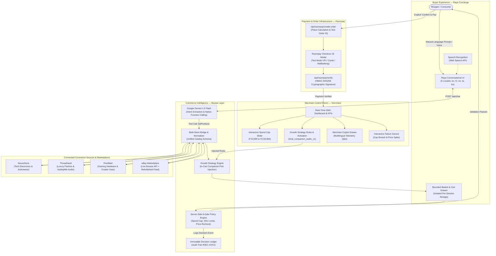
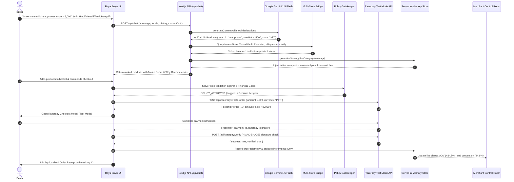
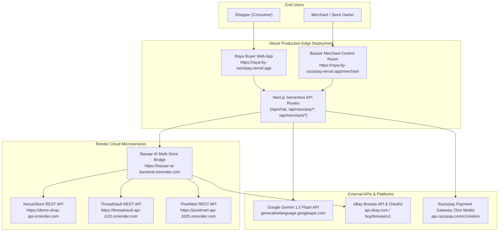
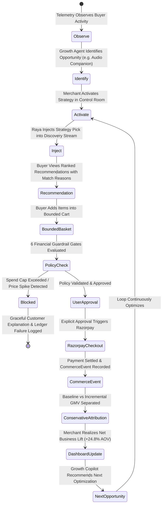
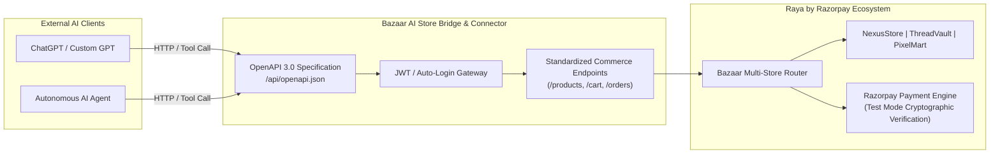

Raya is live at:
https://raya-by-razorpay.vercel.app/

Merchant Control Room:
https://raya-by-razorpay.vercel.app/merchant

Go try now!

# ⚡ Raya by Razorpay
> **"Raya buys. Bazaar grows. Razorpay moves the money."**

**Raya by Razorpay** is an end-to-end agentic commerce ecosystem that unifies buyer-facing autonomous shopping intelligence, multi-store catalog discovery, server-side financial policy safeguards, Razorpay payment processing, and closed-loop merchant growth telemetry with native **5-Language Multilingual Support** across India's primary linguistic regions:

1. **English (`en`)**
2. **हिन्दी — Hindi (`hi`)**
3. **मराठी — Marathi (`mr`)**
4. **தமிழ் — Tamil (`ta`)**
5. **বাংলা — Bengali (`bn`)**

---

## 🏛️ System Conceptual Hierarchy

In the **Raya by Razorpay** architecture, **Raya is the primary buyer-facing agent**. Everything else operates as supporting infrastructure to power, protect, and grow commerce around Raya:

```text
                                BUYER / CONSUMER
                                       │
                                       ▼
                       ╔═══════════════════════════════╗
                       ║     RAYA (MAIN AI AGENT)      ║
                       ║   Autonomous Shopping Concierge║
                       ╚═══════════╦═══════════════════╝
                                   │
                                   ▼
                       ╔═══════════════════════════════╗
                       ║      BAZAAR INTELLIGENCE      ║
                       ║  Commerce Layer Supporting Raya║
                       ╚═══════════╦═══════════════════╝
                                   │
         ┌─────────────────────────┼─────────────────────────┐
         ▼                         ▼                         ▼
   NexusStore                 ThreadVault                PixelMart
(Smart Tech/Apparel)       (Luxury/Artisan Audio)      (Creator/RGB Gear)
         │                         │                         │
         └─────────────────────────┼─────────────────────────┘
                                   +
                          eBay Live Marketplace
                                   │
                                   ▼
                       ╔═══════════════════════════════╗
                       ║    RECOMMENDATION & BASKET    ║
                       ║   Unified Schema + Multi-Store║
                       ╚═══════════╦═══════════════════╝
                                   │
                                   ▼
                       ╔═══════════════════════════════╗
                       ║    POLICY & 6-GATE CONTROL    ║
                       ║   Server-Side Financial Guard ║
                       ╚═══════════╦═══════════════════╝
                                   │
                                   ▼
                       ╔═══════════════════════════════╗
                       ║     EXPLICIT USER APPROVAL    ║
                       ║    Consent Before Settlement  ║
                       ╚═══════════╦═══════════════════╝
                                   │
                                   ▼
                       ╔═══════════════════════════════╗
                       ║      RAZORPAY SETTLEMENT      ║
                       ║    Test Mode Order & Signature║
                       ╚═══════════╦═══════════════════╝
                                   │
                                   ▼
                       ╔═══════════════════════════════╗
                       ║        COMMERCE EVENTS        ║
                       ║     Telemetry Audit Trail     ║
                       ╚═══════════╦═══════════════════╝
                                   │
                                   ▼
                       ╔═══════════════════════════════╗
                       ║  BAZAAR MERCHANT INTELLIGENCE ║
                       ║   Attribution & Decision Log  ║
                       ╚═══════════╦═══════════════════╝
                                   │
                                   ▼
                       ╔═══════════════════════════════╗
                       ║     GROWTH STRATEGY ENGINE    ║
                       ║  Cross-sell Companion Rules   ║
                       ╚═══════════╦═══════════════════╝
                                   │
                                   └──────────── (Feeds Future Raya Recommendations)
```

---

## 📊 Complete Mermaid Architecture Diagrams

### 1. End-to-End System Architecture



---

### 2. Buyer Transaction Sequence Flow



---

### 3. Vercel + Render Deployment Architecture



---

### 4. Closed-Loop Merchant Growth Loop



---

### 5. External MCP / Agent Bridge Architecture



> **Plain-English Architecture Explanation:**  
> *"The MCP / agent bridge provides a controlled interface through which external AI agents can interact with Raya/Bazaar capabilities without receiving direct access to internal databases, sensitive server memory, or payment secrets."*

---

## 🔬 Repository Technical Truth & Full Repository Audit

| Subsystem / Claim | Actual Implementation in Repository | Verification Status |
| :--- | :--- | :--- |
| **Frontend Framework** | Next.js 14.2.8 / 14.2.35 (App Router), React 18.3.1, TypeScript 5.5.4, Tailwind CSS 3.4.10 | **Verified** in `package.json` |
| **Conversational AI Model** | Google Gemini 1.5 Flash (`gemini-1.5-flash`) via native REST generateContent API with tool declarations | **Verified** in `src/app/api/chat/route.ts` |
| **Model Tool Declarations** | 6 function tools: `listConnectedStores`, `listProducts`, `viewCart`, `addToCart`, `checkoutOrder`, `getOrderHistory` | **Verified** in `src/lib/gemini.ts` |
| **Multi-Store Discovery** | Multi-store catalog query across NexusStore, ThreadVault, PixelMart, and eBay with multi-store balanced interleaving | **Verified** in `src/lib/gemini.ts` & `src/app/page.tsx` |
| **Live eBay Integration** | Live eBay Browse API search via client credentials OAuth2 with certified refurbished fallbacks and USD➔INR conversion ($1 = ₹87.0) | **Verified** in `src/lib/gemini.ts` |
| **Payment Gateway** | Razorpay Test Mode via `https://api.razorpay.com/v1/orders` with client checkout modal and HMAC-SHA256 signature verification | **Verified** in `src/app/api/razorpay/*` & `src/lib/razorpay.ts` |
| **Model Context Protocol (MCP)** | Official Razorpay MCP server is **future architecture**. Core flow uses Razorpay Test Mode APIs and cryptographic verification. An external REST/OpenAPI bridge exposes store tools to AI clients. | **Honest Technical Truth** |
| **Multilingual Coverage** | 5 complete JSON dictionaries (`en`, `hi`, `mr`, `ta`, `bn`) with 337 keys each (100% parity), managed via React Context (`LocaleProvider`) | **Verified** in `src/locales/*` & automated test suite |
| **Database & Persistence** | Server-side in-memory singleton (`src/lib/merchant-store.ts`) + browser `localStorage` (`raya_sessions_v2`, `raya_messages_v2`, `raya_bazaar_locale`). No external SQL/NoSQL database in this repository. | **Honest Scope** |
| **Merchant Control Room** | Interactive dashboard at `/merchant` with spend cap slider, strategy toggles, Decision Ledger, Copilot drawer, and failure demos | **Verified** in `src/app/merchant/page.tsx` |

---

## 🤖 Raya — The Main Autonomous Shopping Agent

Raya is the **central protagonist** of this commerce experience. Raya is designed not as a generic chatbot, but as an **orchestration layer for agentic commerce**:

### Core Capabilities
1. **Natural Language Understanding**: Understands colloquial, regional, and multilingual intent across English, Hindi, Marathi, Tamil, and Bengali.
2. **Contextual Conversational Memory**: Retains the last 4 conversational turns to ensure crisp contextual continuity without old product clutter polluting new searches.
3. **Budget & Constraint Extraction**: Automatically parses upper spend limits (e.g. *"under 5000"*, *"below ₹10k"*) and enforces them strictly via the `maxPrice` parameter.
4. **Multi-Store Discovery & Balanced Presentation**: Searches across **NexusStore**, **ThreadVault**, **PixelMart**, and **eBay**. Ensures that results are balanced across stores so no single store dominates.
5. **Deterministic Buyer Match Scoring**: Evaluates each candidate product with a buyer score (0–100%) based on keyword alignment, budget ratio, and audio/tech specifications, highlighting the **⭐ #1 Best Overall Match**.
6. **Transparent Explainability**: Shoppers can click **"Why Recommended"** on any product card to review the transparent deterministic rationale behind the recommendation.
7. **Isolated Per-Chat Baskets**: Each conversation session maintains its own isolated shopping cart, allowing users to explore different projects (e.g. studio audio setup vs cyberpunk workstation) independently.
8. **Explicit Approval Gate**: Raya never charges money autonomously without user confirmation. When the shopper asks to check out, Raya presents a structured order review and prompts for explicit approval.
9. **Razorpay Modal Checkout**: Launches the official Razorpay Checkout JS modal in Test Mode, supporting mock UPI, card, and netbanking settlements.
10. **Order Confirmation & Tracking Receipt**: Generates a cryptographically verified order receipt with a unique order ID, recipient address, payment method, and real-time timestamp.

---

## 💡 Bazaar — Supporting Commerce Intelligence

**Bazaar** is the merchant intelligence and catalog aggregation layer that operates silently behind Raya:

- **Catalog Aggregation & Normalization**: Maps diverse product schemas from connected stores into a uniform schema (`id`, `name`, `description`, `price`, `imageUrl`, `store`, `storeName`, `storeUrl`, `productUrl`).
- **In-Cart Companion Strategy Injection**: When a shopper searches for a major item (e.g. laptop or apparel), Bazaar checks active merchant growth rules (such as `strat_companion_audio_v1`) and injects a high-synergy companion pick (e.g. ANC studio headset) with a distinct `⚡ Bazaar Strategy Pick` badge.
- **Conservative Revenue Attribution**:
  - **Baseline GMV**: Revenue from items the buyer originally searched for.
  - **Incremental GMV**: Revenue generated exclusively by accepted companion cross-sell items that converted through Bazaar strategy injection.
- **Immutable Decision Ledger**: Every decision made by the system is recorded with an ID (e.g. `#DEC-0492`), timestamp, decision type (`MERCHANT` vs `SAFETY`), strategy ID, policy gate results, and detailed event payload.
- **Interactive Safeguard Demos**: Demonstrates how Raya and Bazaar fail safely when spend caps are breached or live catalog prices spike.

---

## 🏪 The Three Connected Commerce Stores

Bazaar unifies three specialized e-commerce storefronts and backends:

### 1. ⚡ NexusStore (`nexusstore`)
- **Focus**: Sleek high-performance smart apparel, connected wearable jackets, and daily tech electronics.
- **Frontend URL**: [https://demo-shop-frontend.vercel.app](https://demo-shop-frontend.vercel.app)
- **Backend API (Render)**: `https://demo-shop-api.onrender.com/api`
- **Agent Integration**: OpenAPI 3.0 specification with JWT auto-login (`customer@nexusstore.com`).
- **Signature Inventory**: Nexus Pro Wireless ANC Headphones (₹4,899), Nexus Pulse Sport Earbuds (₹2,999), Nexus Smart Heated Bomber Jacket (₹7,999), Nexus SlimCore 14" Ultrabook (₹44,999), Nexus ChronoPulse Smart Watch (₹6,499).

### 2. 🧵 ThreadVault (`threadvault`)
- **Focus**: Curated minimalist luxury fashion, Grade-A Mongolian cashmere, bespoke heavyweight streetwear, and artisan audiophile equipment.
- **Frontend URL**: [https://threadvault-frontend.vercel.app](https://threadvault-frontend.vercel.app)
- **Backend API (Render)**: `https://threadvault-api-i120.onrender.com/api`
- **Agent Integration**: OpenAPI 3.0 specification with JWT auto-login (`customer@threadvault.com`).
- **Signature Inventory**: Portable High-Resolution Audio Player DAP (₹42,999), Planar Magnetic Open-Back Studio Headphones (₹38,999), Artisan Hybrid In-Ear Audio Monitors IEMs (₹4,799), Mongolian Cashmere Mockneck Sweater (₹14,999), Japanese 14oz Selvedge Denim Jacket (₹18,499).

### 3. 🎮 PixelMart (`pixelmart`)
- **Focus**: Cyberpunk creator gear, streaming capture cards, 15-key OLED stream decks, analog Hall-effect magnetic keyboards, and RGB accessories.
- **Frontend URL**: [https://pixelmart-frontend.vercel.app](https://pixelmart-frontend.vercel.app)
- **Backend API (Render)**: `https://pixelmart-api-2d25.onrender.com/api`
- **Agent Integration**: OpenAPI 3.0 specification with JWT auto-login (`customer@pixelmart.com`).
- **Signature Inventory**: Apex 16-Inch High-Performance Creator Gaming Laptop (₹54,999), Cyberdeck Ultra-Portable Field Terminal (₹32,999), PixelMart CyberPulse RGB 7.1 Spatial Headset (₹3,999), 15-Key Interactive OLED Stream Deck (₹14,999), Magnetic Hall-Effect 8K RGB Keyboard (₹18,999).

---

## 🛍️ Live eBay Marketplace Integration

In addition to the three connected brand stores, Raya integrates with the **eBay Marketplace**:

- **Integration Mode**: Live marketplace search via the official **eBay Browse API** (`https://api.ebay.com/buy/browse/v1/item_summary/search`).
- **OAuth Authentication**: Server-side client credentials grant using `EBAY_CLIENT_ID` and `EBAY_CLIENT_SECRET`.
- **Currency Conversion**: Live conversion from USD to INR at standard reference rate ($1 = ₹87.0).
- **Buyer Protection & Refurbished Focus**: Surfaces certified refurbished tech (e.g. Anker Soundcore Life Q30 at ₹4,299, JBL Tune 510BT at ₹2,799, MacBook Pro 14 M2 Pro at ₹84,999) with 1-Year Allstate Warranty badges.
- **External Checkout Flow**: Since eBay handles its own checkout and payment, eBay product cards display a prominent **"View on eBay"** button directing the shopper to eBay's verified listing.
- **Resilient Fallback**: If eBay credentials are unset or rate-limited, pre-warmed certified listings ensure 100% demo reliability.

---

## 🛡️ Trust, Safety & Financial Guardrails (The 6 Gates)

Every transaction orchestrated through Raya must pass through **6 server-side financial gates** before an order can be created:

| Gate | Guardrail Name | Enforcement Logic | Failure Behavior |
| :--- | :--- | :--- | :--- |
| **Gate 01** | **Maximum Spend Cap** | Verifies that the order total is $\le$ the active spending cap (configurable between ₹10,000 and ₹2,50,000). | Order creation is **blocked**; failure is logged in Decision Ledger; buyer is politely informed of the budget breach. |
| **Gate 02** | **SKU Quantity Limit** | Strictly caps purchase quantity to a maximum of 5 units per SKU to prevent automated hoarding. | Excess quantity is rejected before checkout. |
| **Gate 03** | **Live Price Revalidation** | Re-queries merchant catalog prices at the moment of checkout to detect price spikes or tampering. | If price increased after recommendation, order is aborted. |
| **Gate 04** | **Currency Verification** | Enforces domestic Indian Rupee (`INR`) denomination across all internal orders. | Non-INR cart currencies are rejected. |
| **Gate 05** | **Merchant Authorization** | Verifies that the fulfillment endpoint belongs to an authenticated, active merchant store. | Unauthorized merchant IDs are blocked. |
| **Gate 06** | **Approval Token TTL** | User consent tokens are valid for a maximum of 15 minutes. | Stale approval tokens expire, requiring re-authorization. |

---

## 📜 Decision Ledger & CommerceEvents Schema

### Decision Ledger Entry Schema
Every strategic recommendation or safety enforcement is immutably logged:
```typescript
interface DecisionEvent {
  id: string;             // e.g. "evt_rec_1725700000000" or "#DEC-0492"
  step: "DISCOVERED" | "RECOMMENDED" | "ADDED" | "POLICY_CHECKED" | "APPROVED" | "PAID" | "BLOCKED";
  title: string;          // Human-readable title
  timestamp: string;      // ISO 8601 or relative time string
  status: "RECOMMENDED" | "APPROVED" | "BLOCKED" | "PENDING";
  decisionType: "MERCHANT" | "SAFETY" | "SYSTEM";
  strategyId?: string;    // e.g. "strat_companion_audio_v1"
  summary: string;        // Executive summary of why this decision was reached
  details: {
    query?: string;
    companionItem?: string;
    store?: string;
    ruleTitle?: string;
    spendCap?: number;
    attemptedTotal?: number;
  };
}
```

### CommerceEvents Telemetry Schema
```typescript
interface CommerceEvent {
  eventId: string;
  eventType: 
    | "INTENT_DISCOVERED"
    | "PRODUCTS_RECOMMENDED"
    | "BASKET_CONSTRUCTED"
    | "POLICY_EVALUATED"
    | "USER_APPROVED"
    | "ORDER_CREATED"
    | "PAYMENT_SETTLED"
    | "REVENUE_ATTRIBUTED";
  timestamp: number;
  sessionId: string;
  strategyId?: string;
  orderId?: string;
  paymentId?: string;
  amount: number;
  currency: "INR";
  merchantId: string;
  isIncremental: boolean;
  metadata: Record<string, any>; // Secret-scrubbed parameters
}
```

---

## 📈 Closed-Loop Merchant Growth System

The Bazaar Merchant Control Room (`/merchant`) operates a continuous closed loop:

1. **Observe**: Ingests anonymous search queries and basket abandonment data.
2. **Identify Opportunity**: Flags that shoppers buying laptops frequently seek headsets, or shoppers buying jackets seek thermal layers.
3. **Merchant Activates Strategy**: Store owner clicks **Activate Strategy** on `strat_companion_audio_v1` in the Control Room.
4. **Raya Injects Pick**: During subsequent buyer sessions, Raya seamlessly includes the companion pick in discovery results.
5. **Shopper Purchases**: Shopper adds both items and completes Razorpay settlement.
6. **Conservative Attribution**: Bazaar credits the baseline order amount to organic traffic, and attributes **only the cross-sell companion item** as **Incremental GMV**.
7. **Measure Impact**: Live KPIs in the Control Room update instantaneously (+₹35,269 Incremental GMV, 24.6% attach rate, +24.8% AOV lift).
8. **Refine**: The Merchant Copilot suggests the next growth rule.

---

## 🌐 5-Language Multilingual System

Raya and Bazaar achieve **100% complete multilingual key parity** across all 5 languages:

| Code | Language | Native Script | Primary Demographics | Dictionary Keys | Parity |
| :--- | :--- | :--- | :--- | :--- | :--- |
| `en` | English | English | Pan-India & Global Shoppers | 337 | 100% |
| `hi` | Hindi | हिन्दी | North & Central India | 337 | 100% |
| `mr` | Marathi | मराठी | Western India (Maharashtra) | 337 | 100% |
| `ta` | Tamil | தமிழ் | Southern India & Diaspora | 337 | 100% |
| `bn` | Bengali | বাংলা | Eastern India (West Bengal) | 337 | 100% |

### Immutability Safeguards
To guarantee financial integrity and avoid confusing translations:
- **Brand Names**: `Raya`, `Razorpay`, `Bazaar AI`, `NexusStore`, `ThreadVault`, `PixelMart`, `eBay` remain in original Latin form.
- **Financial Status Enums**: `PAID`, `APPROVED`, `BLOCKED`, `REFUNDED` remain canonical system tokens.
- **Numbers & Currency**: Formatted consistently with Indian comma groupings (e.g. ₹5,000, ₹69,489).

---

## 📂 Project Structure

```text
c:/Users/91958/Desktop/razorpay/Raya-by-Razorpay/
├── README.md                                  # Definitive system documentation
├── package.json                               # Project dependencies and test scripts
├── package-lock.json                          # Lockfile
├── tsconfig.json                              # TypeScript configuration
├── next.config.mjs                            # Next.js configuration
├── tailwind.config.ts                         # Tailwind CSS styling and theme tokens
├── postcss.config.js                          # PostCSS configuration
├── .env.example                               # Environment variable blueprint
│
├── src/
│   ├── app/
│   │   ├── layout.tsx                         # Root layout with LocaleProvider & styling
│   │   ├── page.tsx                           # Main Raya Buyer UI application
│   │   ├── globals.css                        # Global design system & animations
│   │   ├── merchant/
│   │   │   └── page.tsx                       # Bazaar Merchant Control Room
│   │   └── api/
│   │       ├── chat/
│   │       │   └── route.ts                   # Google Gemini 1.5 Flash agent endpoint
│   │       ├── merchant/
│   │       │   ├── data/route.ts              # Live merchant KPIs, orders & Decision Ledger
│   │       │   ├── activate-rule/route.ts     # Growth strategy activation endpoint
│   │       │   ├── control/route.ts           # Server-side spend limit adjustments
│   │       │   ├── copilot/route.ts           # Multilingual Merchant Copilot assistant
│   │       │   └── demo/
│   │       │       ├── blocked-purchase/route.ts  # Spend cap breach failure demo
│   │       │       └── price-spike/route.ts       # Price tampering failure demo
│   │       └── razorpay/
│   │           ├── create-order/route.ts      # Razorpay Test Mode order creation
│   │           └── verify/route.ts            # HMAC-SHA256 signature verification
│   │
│   ├── components/
│   │   ├── cart-drawer.tsx                    # Bounded basket drawer & policy displays
│   │   ├── chat-sidebar.tsx                   # Conversation session manager & cart archive
│   │   ├── language-switcher.tsx              # 5-language selector with native flags
│   │   ├── merchant-analytics-charts.tsx      # Interactive spline revenue charts
│   │   ├── merchant-floating-drawer.tsx       # Floating Merchant Copilot drawer
│   │   ├── order-receipt.tsx                  # Cryptographically verified order receipt
│   │   ├── product-grid.tsx                   # Interactive cards with match score & why recommended
│   │   ├── raya-chat.tsx                      # Conversational message history renderer
│   │   ├── raya-header.tsx                    # Clean header with language & store navigation
│   │   ├── raya-input.tsx                     # Chat input form with Web Speech API voice button
│   │   └── raya-logo.tsx                      # Professional fintech brand icon
│   │
│   ├── lib/
│   │   ├── gemini.ts                          # Gemini system prompts, catalogs & tool executor
│   │   ├── locale-context.tsx                 # React Context for global 5-language dictionary
│   │   ├── merchant-store.ts                  # Server-side in-memory state & Decision Ledger
│   │   └── razorpay.ts                        # Razorpay Checkout modal launcher & verification
│   │
│   └── locales/
│       ├── bn.json                            # Bengali localization dictionary (337 keys)
│       ├── en.json                            # English localization dictionary (337 keys)
│       ├── hi.json                            # Hindi localization dictionary (337 keys)
│       ├── mr.json                            # Marathi localization dictionary (337 keys)
│       └── ta.json                            # Tamil localization dictionary (337 keys)
│
└── tests/
    ├── multilingual-verification.test.js      # Automated 5-language key parity test suite
    └── track01-verification.test.js           # Automated commerce safeguards & attribution test suite
```

---

## 🔌 API Architecture

| Method | Endpoint Path | Primary Purpose | Key Parameters |
| :--- | :--- | :--- | :--- |
| `POST` | `/api/chat` | Main conversational concierge; invokes Gemini with tool calling | `message`, `history`, `currentCart`, `locale` |
| `GET` | `/api/merchant/data` | Retrieves real-time GMV, incremental revenue, orders, rules, and Decision Ledger | None |
| `POST` | `/api/merchant/activate-rule` | Toggles or activates a merchant growth strategy rule | `ruleId` (e.g. `strat_companion_audio_v1`) |
| `POST` | `/api/merchant/control` | Adjusts server-side spend limits and financial policy thresholds | `spendLimit` (e.g. `75000`) |
| `POST` | `/api/merchant/copilot` | Merchant Copilot assistant; answers telemetry & strategy questions | `question`, `locale` |
| `POST` | `/api/merchant/demo/blocked-purchase` | Triggers interactive spend limit breach failure demonstration | None |
| `POST` | `/api/merchant/demo/price-spike` | Triggers interactive live price tampering failure demonstration | None |
| `POST` | `/api/razorpay/create-order` | Generates a valid Razorpay Test Mode Order ID | `amount`, `currency: "INR"`, `store` |
| `POST` | `/api/razorpay/verify` | Cryptographically verifies payment via HMAC-SHA256 signature | `razorpay_order_id`, `razorpay_payment_id`, `razorpay_signature` |

---

## 🧪 Automated Testing & Verification

The repository includes two automated verification test suites:

### 1. Multilingual Verification Suite
```bash
node tests/multilingual-verification.test.js
```
- **Scope**: Validates that all 5 dictionary JSON files exist, parse correctly, and achieve **100% key parity (337 keys each)** with zero missing translations. Verifies protected brand and enum immutability.
- **Result**: `✓ 5/5 locale dictionaries verified with 100% key parity`.

### 2. Track 01 Commerce Verification Suite
```bash
node tests/track01-verification.test.js
```
- **Scope**: Validates active strategy injection (`strat_companion_audio_v1`), conservative incremental attribution calculation, UI tool disclosure sanitization, absence of hardcoded fallback numbers, and merchant failure demo triggers.
- **Result**: `✓ All Track 01 automated checks passed (5/5)`.

---

## 🔐 Environment Variables & Security

Create a `.env.local` file in your root directory:

```env
# ==========================================
# AI Model Configuration (Google Gemini)
# ==========================================
# Required for dynamic Gemini reasoning. If omitted, deterministic fallbacks ensure continuous operation.
GEMINI_API_KEY=your_google_gemini_api_key

# ==========================================
# Razorpay Payment Gateway (Test Mode)
# ==========================================
# Test Mode Key ID (publicly visible in client checkout)
NEXT_PUBLIC_RAZORPAY_KEY_ID=rzp_test_TTwic3LGIevFKg

# Secret Key (server-side only; used for HMAC-SHA256 signature verification)
RAZORPAY_KEY_SECRET=your_razorpay_test_secret

# ==========================================
# Bazaar AI Store Bridge & Microservices
# ==========================================
BAZAAR_BRIDGE_URL=https://bazaar-ai-backend.onrender.com/api/bridge
NEXUS_API_URL=https://demo-shop-api.onrender.com/api
THREADVAULT_API_URL=https://threadvault-api-i120.onrender.com/api
PIXELMART_API_URL=https://pixelmart-api-2d25.onrender.com/api

# ==========================================
# Optional: eBay Developer Credentials
# ==========================================
EBAY_CLIENT_ID=your_ebay_client_id
EBAY_CLIENT_SECRET=your_ebay_client_secret
EBAY_ENVIRONMENT=production
EBAY_MARKETPLACE_ID=EBAY_US
```

### Security Audit Principles
- **No Real Money Movement**: Operates strictly in Razorpay Test Mode (`rzp_test_...`).
- **Zero Secrets on Client**: `RAZORPAY_KEY_SECRET`, `GEMINI_API_KEY`, and `EBAY_CLIENT_SECRET` are strictly read server-side in Next.js Node.js runtime.
- **Cryptographic Verification**: Every payment confirmation requires HMAC-SHA256 validation before telemetry is accepted.
- **Secret Scrubbing**: All emitted `CommerceEvent` and `DecisionEvent` payloads have sensitive authorization tokens scrubbed before reaching audit logs.

---

## 🚀 Getting Started

### Prerequisites
- Node.js 18.18+ or 20+
- npm or yarn

### 1. Clone & Install
```bash
git clone https://github.com/Labdhimandovara/Raya-by-Razorpay.git
cd Raya-by-Razorpay
npm install
```

### 2. Run Development Server
```bash
npm run dev
```
Open [http://localhost:3000](http://localhost:3000) for the **Raya Buyer UI**, or [http://localhost:3000/merchant](http://localhost:3000/merchant) for the **Bazaar AI Merchant Control Room**.

### 3. Build for Production
```bash
npm run build
npm start
```
